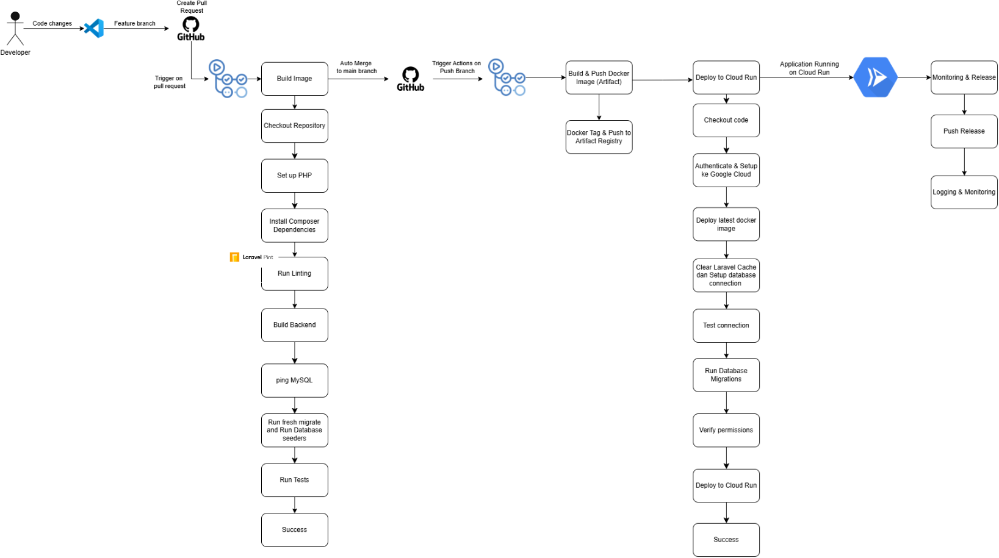
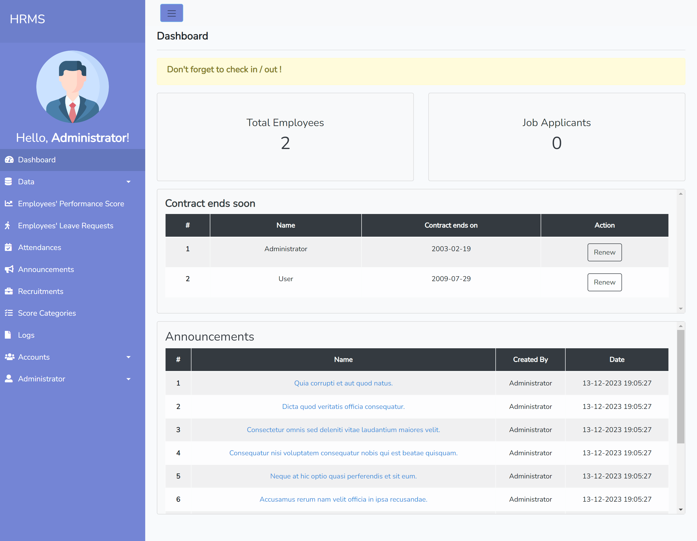
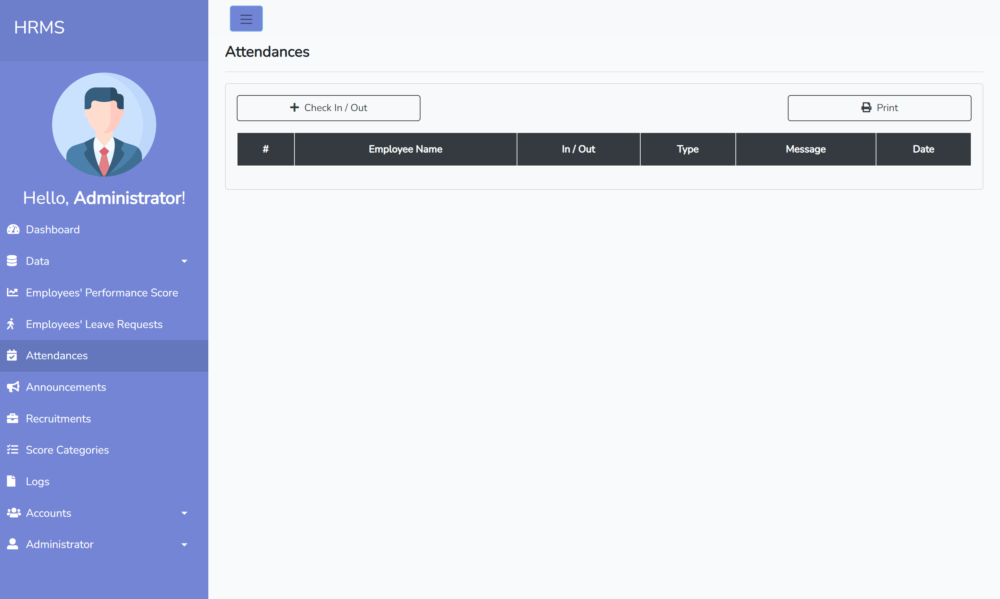

# Human Resource Management System
## Product Description

### Deskripsi
    Aplikasi HRMS - Human Resource Management System merupakan web aplikasi yang dirancang untuk membantu perusahaan dalam mengelola data dan aktivitas karyawan secara terpusat dan terstruktur. Fitur yang tersedia meliputi pembuatan departemen, pengajuan cuti, pengumuman perusahaan, pencatatan kehadiran, manajemen data karyawan, pembuatan role atau hak akses, serta pengaturan kategori penilaian kinerja karyawan.
 
### Latar Belakang
    Banyak perusahaan masih menggunakan cara manual seperti dokumen cetak atau spreadsheet untuk mengelola kehadiran, cuti, dan data karyawan. Cara ini kurang efektif, memakan waktu, dan rawan kesalahan. Selain itu, perusahaan modern memerlukan sistem yang dapat diakses dengan mudah dan mampu memberikan informasi secara real-time agar pengelolaan sumber daya manusia menjadi lebih cepat, terkontrol, dan terukur. Karena itu, dibutuhkan sistem HRMS yang terintegrasi untuk mempermudah proses administrasi HR.

### Tujuan
1. Mempermudah pengelolaan kehadiran, cuti, dan data karyawan secara digital
2. Menyediakan akses terstruktur
3. Menyediakan sistem penilaian berbasis score categori
4. Mempercepat alur komunikasi internal 

### Manfaat
1. Proses HR yang lebih cepat dan efisien
2. Mengurangi human error
3. Meningkatkan transparansi
4. Mempermudah monitoring

## Features
📂 Create Department
Fitur untuk membuat dan mengelola departemen atau divisi dalam perusahaan. Setiap karyawan nantinya bisa dihubungkan ke departemen yang sesuai, sehingga struktur organisasi perusahaan jadi lebih teratur.

👥 Employee Management (Create Employee)
Memungkinkan admin untuk menambahkan, mengedit, dan menghapus data karyawan. Data yang dikelola biasanya meliputi nama, posisi, email, nomor telepon, dan departemen karyawan.

🗂️ Role Management (Create Roles)
Fitur untuk mengatur hak akses atau peran setiap user dalam aplikasi, misalnya: Admin, Manager, atau Karyawan. Dengan ini, setiap pengguna hanya bisa mengakses fitur sesuai dengan perannya.

📅 Leave Request
Karyawan dapat mengajukan izin atau cuti secara online melalui sistem. HR atau atasan bisa menyetujui atau menolak permintaan cuti dengan mudah melalui dashboard.

🕒 Attendance Management
Fitur pencatatan kehadiran yang mempermudah HR dalam memonitor kehadiran karyawan setiap hari. Data absensi terekam otomatis dan dapat dilihat kapan saja.

📢 Announcement
Fitur untuk membuat dan menyebarkan pengumuman resmi perusahaan kepada semua karyawan. Pengumuman akan tampil di dashboard masing-masing karyawan sehingga komunikasi internal lebih cepat.

⭐ Score Categories (Performance Scoring)
Fitur untuk membuat kategori penilaian kinerja karyawan. Perusahaan bisa menentukan aspek-aspek yang ingin dinilai, seperti kedisiplinan, produktivitas, atau kerjasama tim.

## Technology/Tools
1. VSCode
Deskripsi: Visual Studio Code adalah editor kode sumber yang ringan dan dapat diperluas dengan berbagai ekstensi.
Tujuan: Mempermudah proses pengembangan dengan fitur seperti syntax highlighting, debugging, dan integrasi Git secara langsung.
2. Github
Deskripsi: GitHub adalah platform berbasis Git untuk version control dan kolaborasi pengembangan perangkat lunak.
Tujuan: Mengelola riwayat perubahan kode, serta mendukung pull request, code review, dan manajemen issue secara efisien.
3. GitHub Actions
Deskripsi: GitHub Actions adalah fitur CI/CD dari GitHub untuk mengotomatisasi proses build, test, lint, dan deploy melalui workflow berbasis YAML.
Tujuan: Mengotomatiskan pipeline CI/CD agar perubahan kode diuji dan diterapkan secara konsisten, efisien, dan minim kesalahan manusia.
4. GCP IAM
Deskripsi: GCP IAM adalah sistem kontrol akses berbasis identitas yang memungkinkan Anda mengatur siapa yang dapat mengakses resource GCP dan apa yang bisa mereka lakukan.
Tujuan: Menjaga keamanan dan kontrol akses terhadap layanan cloud dengan memberikan hak akses minimum yang diperlukan sesuai peran dan tanggung jawab pengguna.
5. Docker
Deskripsi: platform yang memungkinkan pengembang membungkus aplikasi dan dependensinya ke dalam satu unit yang dapat dijalankan di mana saja.
Tujuan: Menyediakan lingkungan eksekusi yang konsisten, memudahkan pengujian, deployment, dan skalabilitas aplikasi lintas lingkungan (dev, staging, production).
6. CloudSQL
Deskripsi: Layanan database terkelola oleh Google Cloud yang mendukung MySQL, PostgreSQL, dan SQL Server, menawarkan skalabilitas dan keamanan tinggi.
Tujuan: Menyediakan penyimpanan data yang andal dan mudah dikelola untuk mendukung aplikasi. 
7. Cloud Run
Deskripsi: Platform serverless untuk menjalankan kontainer, memungkinkan deployment aplikasi dengan skalabilitas otomatis dan tanpa pengelolaan server.
Tujuan: Memastikan aplikasi dapat berjalan efisien dengan biaya rendah dan skalabilitas sesuai kebutuhan. 
8. Laravel Pint
Deskripsi: Alat linting untuk Laravel yang memastikan kode PHP konsisten dan sesuai standar kualitas.
Tujuan: Meningkatkan kualitas kode, mempermudah kolaborasi tim, dan mengurangi bug dalam pengembangan.
  
## CI Workflow
trigger on pull request to branch main. 
jobs:
1. test dijalankan di ubuntu-latest.
2. konfigurasi service mysql
3. Konfigurasi env
4. Steps yang dilakukan:
1) checkout code
2) setup PHP 8.2
3) Install composer dependencies
4) Verifikasi instalasi laravel pint
5) Menjalankan laravel pint untuk linting
6) Build backend
7)  Melakukan tes ping ke MySQL
8)  Menjalankan migrasi database
9)  Menjalankan seeder Database
10)  Menjalankan PHPUnit test 
    

## CD Workflow
trigger on push to main branch.
jobs yang dilakukan: 
1. melakukan deploy di ubuntu-latest menggunakan env GCP
2. steps:
1) checkout code
2) melakukan autentikasi ke Google cloud
3) Melakukan setup google cloud SDK
4) Melakukan konfigurasi docker untuk menggunakan kredensial gcloud
5) Debug Docker config
6) Build and push docker image
7) Membersihkan laravel cache
8) Melakukan test koneksi database
9) Menjalankan migrasi database
10) Melakukan verifikasi permission file
11) Melakukan deploy ke google cloud run

## PIPELINE CI/CD

## Steps to run this application:

1. Click on `<> Code` button
2. Copy the HTTPS/SSH repository link
3. Run `git clone` command on your terminal.
4. Install the necessary dependencies by running `composer install`
5. Creating .env file by `cp .env.example .env` and fill in the necessary fields, e.g.: database connection, etc.
6. Generate the application key by running `php artisan key:generate`
7. Next, run the database migration with this `php artisan migrate` command.
8. You can seed the database with `php artisan db:seed` command.
9. Lastly, serve the application with this `php artisan serve` command.
10. The HRMS application should accessible on your browser on "http://localhost:8000"

### Login Credentials

You can log into the application with this credentials (if you did the database seeding).

-   Username: `admin@gmail.com`
-   Password: `admin`

## Screenshots

**Home Screen**

**Dashboard Screen**

**Employee List Screen**

**Employee Leaves Screen**

**Attendances Screen**

**Recruitment Screen**

**Recruitment Detail Screen**

